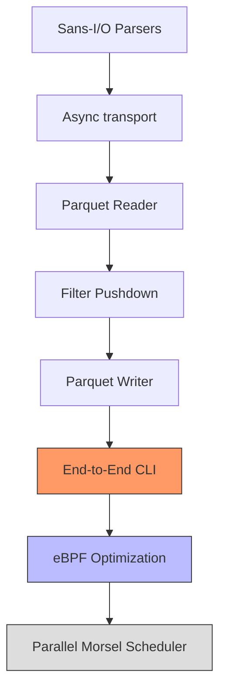

# ZPQ Project Status: High-Performance Parquet Engine (Zig)

**Last Updated**: Jan 9, 2026
**Status**: Implementation Phase - TLS/S3 transport fixed, now implementing parallel prefetching.

---

## 🚀 Vision: Zero-Copy, Non-Blocking S3 Data Processing

ZPQ is moving from a Python proof-of-concept into a high-performance native Zig engine. The core architectural shift is from synchronous processing to a **fully pipelined, non-blocking flow** powered by `libxev` (io_uring on Linux).

### Current Achievement vs Vision
- [x] **Sans-I/O Protocols**: HTTP, S3, and Parquet parsing are decoupled from sockets.
- [x] **RandomAccessSource**: Uniform interface for Local and S3 sources.
- [x] **Async S3 Source**: Fully non-blocking S3 GET and HEAD operations.
- [x] **Parquet Reader**: Monomorphized "Polars-Killer" loop with run-skipping and filter pushdown.
- [x] **Parquet Writer**: Buffering, Snappy compression, and metadata footer generation.
- [x] **High-Performance Logging**: MPSC lock-free logger with consolidated `eventfd` notifications.

---

## 🛠 Recent Critical Fixes

While capturing performance baselines, several deep-seated issues were identified and resolved:

1.  **S3 Busy-Wait Hang**: Fixed a condition where the `xev` loop would spin at 100% CPU waiting for a closed connection (EOF). Added strict EOF propagation through the transport layer.
2.  **Reader Liveloop**: Fixed `ParquetReader.nextBatch` which failed to advance the row pointer on empty selection batches, causing infinite retry loops.
3.  **Zig 0.16.x Compatibility**: Modernized the codebase for the latest Zig `std.Io` changes and fixed `ArrayList` usage patterns.

### Jan 9, 2026: TLS Transport Layer Fixes

Critical bugs in the S3/TLS transport were identified and fixed:

4.  **TLS Record Buffering**: A single TCP read could contain multiple TLS records, but only the first was being decrypted. Added a drain loop in `transport.onRead` to call `decrypt()` repeatedly until no more buffered data remains.
5.  **Graceful TLS Close**: `TlsConnectionClosed` errors are now handled gracefully when the server sends `close_notify`, setting `closed=true` instead of propagating an error.
6.  **Read Scheduling After Handshake**: Fixed condition where reads weren't scheduled after TLS handshake completed due to an `else if (!self.handshake_done)` guard.
7.  **Stopped Flag for Response Completion**: Added `stopped` flag that callers set when HTTP response is complete, preventing transport from scheduling more reads on a finished connection.
8.  **FD Leak Fix**: `transport.Connection.deinit` now explicitly closes the socket FD via `posix.close()` since libxev wrappers are non-owning.
9.  **Memory Leak Fix**: `main.zig` now properly tracks and frees `sink_ptr` allocation in defer block.

---

## 📊 Observability: High-Performance Logging

We have integrated a project-wide `AsyncLogger` designed for zero impact on worker threads:
- **Lock-Free**: Uses an intrusive MPSC queue.
- **Consolidated Notifications**: producer threads only wake the event loop once per batch, minimizing syscall overhead.
- **Correlation IDs**: Integrated support for `--cid` to trace requests across async task boundaries.

---

## 🎯 What's Next: Parallel S3 Prefetching

**Current Focus**: Implement DuckDB-style parallel prefetching within a single `zpq` process using libxev.

### Connection Pool Architecture (In Progress)

The goal is to issue N concurrent S3 range requests from a single event loop, maximizing throughput by overlapping network I/O.

```
┌─────────────────────────────────────────────────────────────┐
│                     PrefetchQueue                           │
├─────────────────────────────────────────────────────────────┤
│  pending: [ RangeReq, RangeReq, ... ]                       │
│  in_flight: N connections actively fetching                 │
│  completed: [ (offset, data), ... ]                         │
└─────────────────────────────────────────────────────────────┘
                          │
                          ▼
┌─────────────────────────────────────────────────────────────┐
│                   ConnectionPool (N=4)                       │
├───────────┬───────────┬───────────┬───────────┬─────────────┤
│  Conn[0]  │  Conn[1]  │  Conn[2]  │  Conn[3]  │   ...       │
│  state:   │  state:   │  state:   │  state:   │             │
│  idle/    │  reading  │  idle     │  handshake│             │
│  request  │  response │           │           │             │
└───────────┴───────────┴───────────┴───────────┴─────────────┘
                          │
                          ▼
┌─────────────────────────────────────────────────────────────┐
│                    libxev Event Loop                        │
│  io_uring: multiplexes all TCP/TLS ops on single thread     │
└─────────────────────────────────────────────────────────────┘
```

### State Machine Per Connection

```
     ┌──────────┐
     │   IDLE   │ ◄─────────────────────────────────┐
     └────┬─────┘                                   │
          │ submit(RangeRequest)                    │
          ▼                                         │
     ┌──────────┐                                   │
     │RESOLVING │ DNS lookup via thread pool        │
     └────┬─────┘                                   │
          │ onResolved(addr)                        │
          ▼                                         │
     ┌──────────┐                                   │
     │CONNECTING│ TCP connect                       │
     └────┬─────┘                                   │
          │ onConnect                               │
          ▼                                         │
     ┌──────────┐                                   │
     │HANDSHAKE │ TLS handshake                     │
     └────┬─────┘                                   │
          │ onHandshake                             │
          ▼                                         │
     ┌──────────┐                                   │
     │ SENDING  │ Write signed S3 GET request       │
     └────┬─────┘                                   │
          │ onWrite complete                        │
          ▼                                         │
     ┌──────────┐                                   │
     │ READING  │ Parse HTTP response + body        │
     └────┬─────┘                                   │
          │ parser.state == .done                   │
          ▼                                         │
     ┌──────────┐   mark request complete           │
     │COMPLETING│ ──────────────────────────────────┘
     └──────────┘   tryStartNext() if pending
```

### Implementation Tasks

1. **PrefetchQueue**: Track pending/in-flight/completed ranges with merge capability for adjacent requests
2. **ConnectionPool**: Manage N `PooledConnection` instances, each with own TLS state ✅
3. **Request Dispatch**: When connection becomes idle, pop from pending queue and start request ✅
4. **Connection Reuse**: HTTP keep-alive to avoid DNS/TLS overhead per request ✅
5. **Backpressure**: Limit in-flight requests to avoid overwhelming network/memory
6. **Integration**: Modify `AsyncS3Source.readAt` to check completed queue before issuing new request

### Benchmark Results (probe_s3_prefetch.zig)

| Test | Connections | Data | Time | Throughput |
|------|-------------|------|------|------------|
| No reuse | 4 | 1 MB | 2069 ms | 0.51 MB/s |
| Keep-alive | 4 | 1 MB | 323 ms | 3.24 MB/s |
| Keep-alive | 4 | 10 MB | 1968 ms | 5.33 MB/s |

Connection reuse provides **6.4x speedup** by eliminating DNS+TLS handshake per request.

### Reference: DuckDB Pattern

From `thrift_tools.hpp`:
- `ReadAheadBuffer`: Pre-registers ranges, merges adjacent ones
- Two-phase: `RegisterPrefetch(offset, len)` then `PrefetchRegistered()`
- Allows query planner to batch all needed ranges before any I/O starts

---

## 🗺 Implementation Roadmap



---

## 🔬 libxev Architecture & Usage Findings (Ghostty Reference)

A deep-dive into `libxev` usage patterns, referenced against `ghostty`, revealed critical lifecycle management rules that differ from standard Zig RAII patterns:

1.  **Strict Lifecycle Management**: `libxev` wrappers (`xev.TCP`, `xev.Stream`) are **non-owning** handles. Their `deinit` methods (if they exist) do **NOT** close the underlying file descriptor.
    *   *Reference*: `ghostty` uses `Pty` struct to manage FD ownership, calling `posix.close` explicitly in `Pty.deinit`. `xev.Stream` is initialized from these FDs but its `deinit` is separate and does not close the FD.
2.  **Explicit Cleanup**: The application is responsible for ensuring the FD is closed, either via `xev.TCP.shutdown/close` (async) or `posix.close` (synchronous) after ensuring no pending loop operations remain.
3.  **Use-After-Free Risks**: Destroying a `Connection` struct while `xev` has pending completions (read/write/close) leads to Use-After-Free when the completion fires and tries to access the callback context (the destroyed struct).
    *   *Remediation*: Connections must tracked or reference-counted, or the loop must be drained/cancelled before memory destruction.
4.  **Current ZPQ Defect (FIXED Jan 9)**: `transport.Connection.deinit` now explicitly calls `posix.close(fd)` to close the socket. The `closed` flag prevents double-close.
    *   *Original Verification*: `probes/probe_xev_lifecycle.zig` confirmed `xev.TCP` leaves FDs open.

